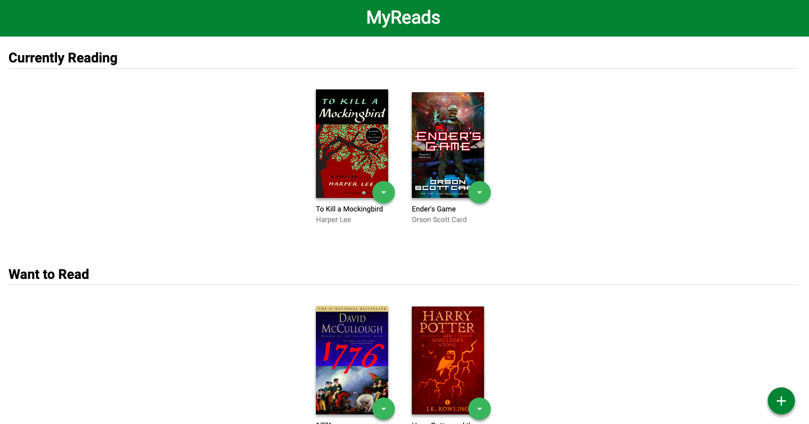

import { Head } from "mdx-deck";
export { future as theme } from "mdx-deck/themes";

<Head>
    <title>Knowledge Session (1) 🤯</title>
</Head>

# Knowledge Session (1) 🤯

---

# Announcement

import { Appear } from "mdx-deck";

<Appear>
    <h2>Calendly</h2>
    <h2>Slack app</h2>
    <h2>MyReads</h2>
</Appear>

---

# React Dev Tools

---

import { Image } from "mdx-deck";

<Image src="https://raw.githubusercontent.com/TianyuanC/knowledge-652-1/master/img/react_dev.png" />

---

<Image src="https://raw.githubusercontent.com/TianyuanC/knowledge-652-1/master/img/react_org.png" />

---

# Questions?

---

# MyReads

---

import { SplitRight } from "mdx-deck/layouts";

export default SplitRight;



## [Repo](https://github.com/udacity/reactnd-project-myreads-starter)

## [Postman](https://www.getpostman.com/)

## [Books_API](https://reactnd-books-api.udacity.com)

---

# Questions?

---

# FAQ review

-   ES6
-   Editor: VSCode
-   Terminals
-   Git

---

import Code from "mdx-code";

# ES6

-   Map
-   Filter
-   Reduce

---

export default Code;

```javascript Map
const counts = [1, 2, 3];
console.log(counts);
// [1, 2, 3]

const countsDouble = counts.map(count => count * 2);
console.log(countsDouble);
// [2, 4, 6]
```

---

# ES6

## Arrow Functions

---

# ES6

## Promises

---

# There must be questions 🤣

---

# My VSCode

---

# Thoughts?

---

# Terminal basics

---

# All good?

---

# Git intro

---

# Questions?

---

# Recap

-   React Dev Tools
-   MyRead
-   ES6
-   Editor: VSCode
-   Terminal
-   Git

---

# Until next time 👋
